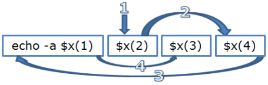
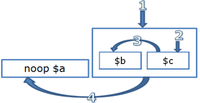
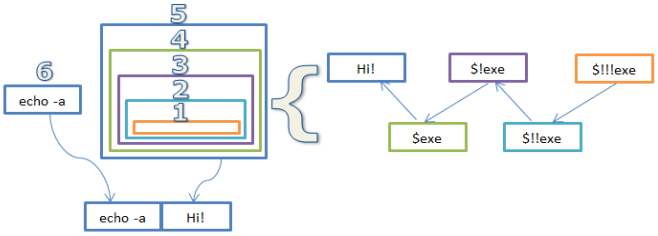
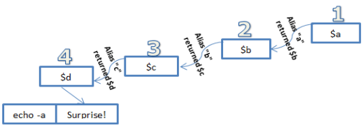
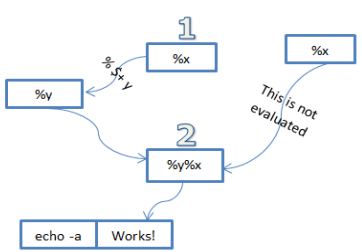
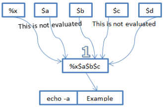
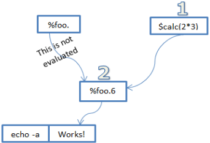

Eval Brackets
=============

Standard mIRC code is executed, as expected, top down and left right. Evaluation brackets (or Eval Brackets) are a mechanism by which a program can alter the natural behavior of the mIRC interpreter.

Evaluation brackets allows us to:

1. Change the order of evaluation
2. Change the number of evaluations

Order of Evaluation
-------------------

Consider the following code:

.. code:: text

  //echo -a Hello World, it's $me $+ !

.. figure:: Eval1.png

Typical code is evaluated from left to right, one word at a time.

.. code:: text

  alias x echo -a $1 | return $1
  alias eval_example {
    echo -a $x(1) $x(2) $x(3) $x(4)
  }

If we run the code above we will get the following result:

.. code:: text

  1
  2
  3
  4
  1 2 3 4

As expected, $x(1) was evaluated first, $x(2) was evaluated second, $x(3) was evaluated third and $x(4) was evaluated last. Earlier we said that we can use evaluation brackets to change the order of evaluation. We will demonstrate that in our next example:

.. code:: text

  alias x echo -a $1 | return $1
  alias eval_example {
    echo -a $x(1) [ $x(2) ] $x(3) $x(4)
  }

In this example we surrounded $x(2) with a pair of bracket. The code produced the following result:

.. code:: text

  2
  1
  3
  4
  1 2 3 4

From the output you can see that $x(2) was evaluated first (as shown in the graph below). Once the content of the evaluation bracket was evaluated, the parser went on to evaluating the rest of the line like it would normally from left to right.

.. figure:: Eval2.png

.. note:: Changing the order of evaluation does not change the position of the evaluated value in the actual line.

We can have multiple groups of brackets on the same line. Note that once the parser is done evaluating the first block (from left to right), the parser will proceed to the next pair of evaluation brackets. Let's look at the following example:

.. code:: text

  alias x echo -a $1 | return $1
  alias eval_example {
    echo -a $x(1) [ $x(2) ] $x(3) [ $x(4) ]
  }

The code above produced the following results:

.. code:: text

  2
  4
  1
  3
  1 2 3 4

This time we have two pairs of evaluation brackets. mIRC went from left to right evaluating $x(2) first then $x(4). The parser then went on to evaluate rest of the line.

Nested evaluation brackets
~~~~~~~~~~~~~~~~~~~~~~~~~~

Once the parser reached the first evaluation group, it enters it. The process begins all over again inside the evaluation group - it evaluates the content from left to right. If we nest another pair of evaluation brackets we force the parser to evaluate that part first then continue on to the rest of the evaluation content inside that bracket.

Consider the following code:

.. code:: text

  alias a echo -a A
  alias b echo -a B
  alias c echo -a C
  alias eval_example {
    noop $a [ $b [ $c ] ]
  }

The code above produces the following result:

.. code:: text

  C
  B
  A

The graph above demonstrates how once the parser enters the outer pair of brackets, the entire process starts all over and the first thing that gets evaluated are the inner brackets.

.. note:: Once an evaluation group is complete, it is taken out of the rest of the line.

Interestingly enough, with three identifiers it is possible to generate every single permutation by just using evaluation brackets:

.. code:: text

  alias a set %str %str $+ A
  alias b set %str %str $+ B
  alias c set %str %str $+ C
  alias d unset %str
  alias eval_example {
    echo -a ABC =>   $a   $b     $c     %str $d
    echo -a ACB => [ $a ] $b [   $c ]   %str $d
    echo -a BAC =>   $a [ $b ]   $c     %str $d
    echo -a BCA =>   $a [ $b ] [ $c ]   %str $d
    echo -a CAB =>   $a   $b [   $c ]   %str $d
    echo -a CBA =>   $a [ $b [   $c ] ] %str $d
  }

Will produce the following result:

.. code:: text

  ABC => ABC
  ACB => ACB
  BAC => BAC
  BCA => BCA
  CAB => CAB
  CBA => CBA

Number of Evaluations
---------------------

Until now we have been dealing with the order by which the interpreter evaluates things. We will now move on to looking at how many times a single evaluation block gets evaluated.

Under normal conditions, every part of the line is evaluated exactly once.
For simplicity sake we will define a normal condition as any statement that does not contain $(), $eval(), or $evalnext(). The statement above should feel pretty intuitive. Consider:

.. code:: text

  //echo -a [ $!me ] [ $!me ]

The above code is logically equivalent to:

.. code:: text

  //echo -a $!me $!me

In both cases everything is evaluated once. A single pair of evaluation brackets causes the interpreter to evaluate the code once.

A code segment is evaluated once more for every additional pair of enclosing evaluation brackets unless:
1.  The code segment contains spaces, and
2.  It does not contain $+ to "close the space gap"

If the conditions above are violated, the code segment is evaluated only once. Any additional enclosing evaluation brackets are simply ignored.
We will talk about the $+ case later on.

Spaces in code segment
~~~~~~~~~~~~~~~~~~~~~~

A space in the code segment is a violation of the first part. This nullifies the behavior of the reset of the enclosing brackets. Here is an example:

.. code:: text

  alias exe echo -a I was called!
  ; example:
  alias example echo -a [ [ [ [ [ [ [ [ [ [ [ [ [ Hi! [ $!exe ] ] ] ] ] ] ] ] ] ] ] ] ] ]

The code above will indeed print:

.. code:: text

  Hi! $exe

.. note:: The exe alias was never called, not even once. Before we move on, it is important to note that if we have a code segment inside another code segment. That code segment follows the rules all over from the start. Consider the following example:

.. code:: text

  //echo -a [ [ [ a $!me ] ] ] <=> [ [ [ a [ $!me ] ] ] ] <=> [ [ [ a [ [ $!me ] ]  ] ] ]

The last part had a sub-code segment with no spaces: "[ [ $!me ] ]". Since $!me has no spaces, it will be evaluated once (to $me) and then the outer brackets will evaluate it once again to your name. In my case we get "a David". Since now we have a space in the code segment, all the outer brackets are nullified (as with the other two cases separated by <=>).

The code above will produce something like:

.. code:: text

  a $me <=> a $me <=> a David

Multiple evaluations
~~~~~~~~~~~~~~~~~~~~

If we follow the simple rule above, we can easily evaluate a specific code segment multiple times. Consider the following example:

.. code:: text

  alias exe echo -a I was called! | return Hi!
  ; example:
  alias example echo -a [ [ [ $!!exe ] ] ]

The above code prints:

.. code:: text

  I was called!
  Hi!

.. note:: The graph below was made as though [ [ [ [ [ $!!exe ] ] ] ] ] with fives 5 '!' on $exe instead of two, but for technical reason 3 or more '!' can't be rendered for now.

Here is a more interesting example of multiple evaluations:

.. code:: text

  alias a return $!b
  alias b return $!c
  alias c return $!d
  alias d return Surprise!
  alias example echo -a [ [ [ [ $a ] ] ] ]

The above code will print:

.. code:: text

  Surprise!

Solving the space issue using $+()
----------------------------------

By now we already know that the following code will only evaluated once since it violates the first rule: spaces in the code segment.

.. code:: text

  //echo -a [ [ a $!me ] ]

Prints:

.. code:: text

  a $me

The easiest way to fix this issue is to surround the entire group with $+() and put a space ($chr(32)) between the two tokens. This means we no longer have spaces (note that spaces inside the identifier are superfluous).

.. code:: text

  //echo -a [ [ $+(a, $chr(32), $!me) ] ]

Because we now have no spaces, the additional evaluation bracket is not ignored and our code is evaluated once again:

.. code:: text

  a David

$+ Special behaviors
--------------------

Inside evaluation brackets, the $+ concatenation construct (unlike $+(), $+ itself is not an identifier, it doesn't return a value) exhibits some special behavior.

[ A $+ B ] Format
~~~~~~~~~~~~~~~~~

The rule about [ A $+ B ] is:

.. code:: text

  The [ token_A $+ token_B ] arrangement will cause token_A to evaluate once and then be concatenated to token_B (evaluated zero times). and then the concatenated string is evaluated. I.e.:
  [ A $+ B  ]  <=> $($(A, 1) $+ $(B, 0), 2)

Additional pairs of $+ are treated in the same way as if they were grouped using evaluation brackets:

.. code:: text

  [ A $+ B $+ C ] <=> [ [ A $+ B ] $+ C ]

Which can be written as:

.. code:: text

  $($($($(A, 1) $+ $(B, 0), 2), 1) $+ $(C, 0) ,2)

This pattern can be extended to unlimited number of tokens.

Here is a quick example showing how the second token is never evaluated:

.. code:: text

  //echo -a [ x $+ $y ] and [ x $+ %y ]

Which prints:

.. code:: text

  x$y and x%y

Let's wrap this section with a strange line of code:

.. code:: text

  //var %x = % $+ y, %y%x = Works! | echo -a [ %x $+ %x ]

A [ $+ B ] Format
~~~~~~~~~~~~~~~~~

With the A [ $+ B ] Format, we have:

.. code:: text

  The token_A [ $+ token_B ] arrangement will cause token_A (evaluated zero times) to be concatenated to token_B (evaluated zero times) and then the concatenated string is evaluated. I.e.:
  A [ $+ B ] <=> $($(A, 0) $+ $(B, 0), 2)

Note that a $+ at the beginning of an evaluation bracket causes this zero-eval behavior to propagate to every other token in the group:

.. code:: text

  A [ $+ B $+ C $+ ... ] <=> $($(A, 0) $+ $(B, 0) $+ $(C, 0) $+ ..., 2)

Consider the following example. Before of the initial $+, all the other identifiers are never evaluated before being concatenated:

.. code:: text

  //echo -a X [ $+ $a $+ $b $+ $c $+ $d ]

As expected, we get:

.. code:: text

  X$a$b$c$d

Here is a better example

.. code:: text

  //var %x$a$b$c$d = Example! | echo -a %x [ $+ $a $+ $b $+ $c $+ $d ]

The code above prints:

.. code:: text

  Example!

Note that other, unrelated, tokens are still evaluated as we expect:

.. code:: text

  //echo -a X [ $+ $a $+ $b $+ $c $me ]

As expected, we get:

.. code:: text

  X$a$b$c David

A [ $+ [ B ] ] Format
~~~~~~~~~~~~~~~~~~~~~

.. code:: text

  The A [ $+ B ] format is not very helpful alone since B is never evaluated. We can combine our ability to evaluate things multiple times with the A [ $+ B ] format to form some more usable things.

.. code:: text

  A [ $+ [ B ] ] <=> $($(A, 0) $+ $(B, 1), 2)

The most common application of this is dynamic variables. Consider the following segment:

.. code:: text

  //var %foo.6 = Works! | echo -a %foo. [ $+ [ $calc(2*3) ] ]

The most common form is %var. [ $+ [ $nick ] ] which allow you to retrieve a value from a variable specifically created for $nick.

Inside identifiers
------------------
By now you know evaluation brackets happen before the code itself evaluates, but what about identifiers?

Spaced out [ ]
~~~~~~~~~~~~~~

If you space out the [ ] inside the identifier, the previous rules apply

.. code:: text

  //echo -a [ $me ] $+( [ $!me ] )

Here both [ ] are resolved at the same time. However after [ ] are resolved, the line becomes:

.. code:: text

  //echo -a David $+( $me )

And here $+() will normally evaluate $me, so doing that results in a double evaluatation of the parameter, watch out.

More importantly, since the resolution of [ ] happens before the identifier itself is evaluated, it will correctly parse code that is a direct result of the evaluation brackets. Here is some code to demonstrate this behavior:

.. code:: text

  //var -s %x = mid(@Example!,2,8, %y = ) | echo -a $ [ $+ [ %x $+ [ %y ] ] ]

The above code prints:

.. code:: text

  * Set %x to mid(@Example!,2,8
  * Set %y to )
  Example!

Here is another one:

.. code:: text

  //var %x = @@XYZ@@,3,3 | echo -a $mid( [ %x ] )

Which will print:

.. code:: text

  XYZ

The interpreter is able to handle the commas and braces as part of the code.

Non spaced out [ ]
~~~~~~~~~~~~~~~~~~

If you don't space out the [ ], they will be interpreted when the identifier evaluate each parameter:

.. code:: text

  alias changev1to2 if (2) noop
  alias changev1to3 echo -a param: $1 | if (3) noop
  alias custom echo -a $1 $3
  //if (1) noop $changev1to2 $custom($v1,$changev1to3( [ $v1 ] ),[ $v1 ])

Here, the first parameter passed to $custom, $v1, will have the value '2', because just before $custom is evaluated, $changev1to2 is evaluated, and that changes $v1.

The [ $v1 ] for the $changev1to3 alias, is resolved when the line is evaluated for the /noop command, because of the spacing. At this point $v1 is '1', from the original //if that is executed.

The non spaced [ $v1 ] for the third parameter of $custom, is not resolved for the /noop command, here are the inbetween steps:

//if evaluates, the condition is '1' so $v1 is set 1
noop $changev1to2 $custom($v1,$changev1to3( [ $v1 ] ),[ $v1 ]) is the command to be executed for that if
[ ] are processed for the line, the [ $v1 ] for the $changev1to3 alias is resolved, so $v1 is our current value so far: 1
the line is evaluated, $changev1to2 is evaluated and set $v1 to 2
$custom is evaluated, its first parameter $v1, is then 2
the second parameter of $custom evaluates "$changev1to3( 1 )" to $null, but it sets $v1 to 3 ('1' is our previous $v1 code, although it's no problemo here, keep in mind: it's double evaluated!)
the third parameter of $custom evaluates: the [ ] are resolved, $v1 evaluates once (no double evaluation) to 3

..note:: The non spaced [ $v1 ] is not required to get $v1 to be 3, not using [ ] would also correctly make $v1 3 since $changev1to3 was just called, but it illustrates that the [ ] are not resolved at the same stage depending on the spacing.

..note:: Non spaced [ ] inside identifier are equivalent to $eval(), they do not make the identifier reevaluate the code:

.. code:: text

  //var %a 1,32 | echo -a $gettok(a b,[ %a ]) is just going to evaluate twice ,1,32 and then pass 1,32 as the second parameter to $gettok

This makes non spaced [ ] inside bracket pretty useless. Spaced out [ ] are handy for passing dynamic parameters to an identifier (again this double evaluates the argument so be careful):

.. code:: text

  $ident( [ %params ] )

Escaping Evaluation Brackets
----------------------------

Evaluation brackets can be escaped by using double brackets ([[) without spaces. For example:

.. code:: text

  //echo -a [[ [[ example! ]] ]] 

The code above prints:

.. code:: text

  [ [ example! ] ]

.. note:: Without a complete pair, a single bracket is not treated as anything special. The following example is also acceptable:

.. code:: text

  //echo -a [[ [[ example! ] ]

It's a good time to also note that escaped evaluation brackets are not exactly the same as using $chr(91) and $chr(93). The escaped evaluation brackets happen at the same phase of evaluation as the actual evaluation bracket processing. Consider the following example:

.. code:: text

  //echo -a $mid( [[ [[ example! ]] ]] , 1) =>  $mid( $chr(91) example! $chr(93) , 1)

The code above prints:

.. code:: text

  [ example! ] => [ example! ]

Additional Odd Behaviors
------------------------

Below are a few odd behaviors that are worth mentioning.

[ A $+ ] B Format
~~~~~~~~~~~~~~~~~

The reason we have not mentioned this format above is because its behavior is rather buggy. The [ A $+ ] B format behaves like [ A $+ B ] where B is evaluated zero times. This behavior propagates to multiple tokens as well. For example:

.. code:: text

  //echo -a [ A $+ ] $me $+ $me $+ $me

Prints:

.. code:: text

  A$me$me$me

This is more of a buggy behavior than anything else and should be avoided. Any code that relies on this is almost certainly doing something wrong.

$++
~~~

This construct behaves just like the $+ construct without exhibiting the special behavior inside the evaluation brackets. Note that normally there is no reason to use this construct. Here is an example:

.. code:: text

  //echo -a [  $!!me $++ $!me ]  vs. [ $!!me $+ $!me ]

The above code prints:

.. code:: text

  $!me$me vs. $me$!me

Or with the previous example:

.. code:: text

  //echo -a [ A $+ ] $me $++ $me $++ $me

Which evaluates the last two $me correctly.

Commands with Special Behavior
------------------------------

Not all commands are equal. Below is a list of some regular commands that have special evaluation routines that allow us to get the job that would otherwise require evaluation brackets:

# /var
# /set
# /inc
# /dec
# /unset
# /sockwrite

.. code:: text

  alias example {
    var %x $+ $calc(4 * 4) $+ y 200 
    inc %x $+ $calc(4 * 4) $+ y 
    echo -a : %x [ $+ [ $calc(4*4) $+ y ] ] 
    unset %x $+ $calc(4 * 4) $+ y 
    echo -a : %x [ $+ [ $calc(4*4) $+ y ] ]
  }

The code above will print:

.. code:: text

  :201
  :

.. note:: Unlike the reset of the commands, /unset cannot set variables in the format of %var $+ %var. Evaluation brackets are needed to fix this.

Quirks
------

jaytea