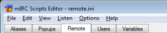
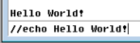
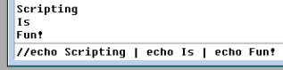
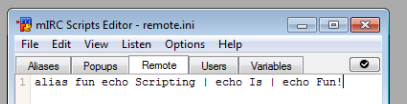
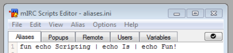
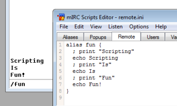
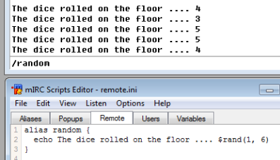
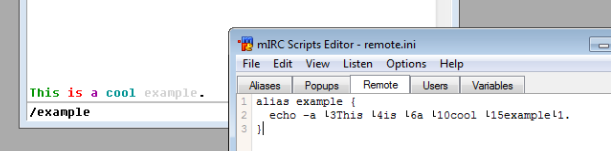
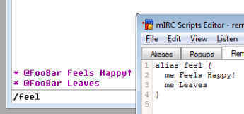

Bootcamp
========

This article focuses on the very basics of mIRC Scripting. The target audience is people with no knowledge, or very limited knowledge, of the mIRC scripting language.

Where Does The Code Go?
-----------------------

All of your code, regardless of its type, should go in the Script Editor. To open the script editor press-and-hold the Alt key on your keyboard, and then tap the R key (:kbd:`Alt+R`). Alternatively, you can go to the Tools Menu -> Script editor.

Below is a screen shot of the mIRC Script Editor:

You will notice that there are five selectable tabs: Aliases, Popups, Remotes, Users, and Variables. Let’s try and get you familiar with each one. Before we dive into what these do, let’s get to know some basics first.

The Very Basics
---------------

Let’s take a few moments to help familiarize you with the following key components:

Statements
~~~~~~~~~~

Every script is composed of one or more statements. A statement describes something that needs to happen. Each statement must go on its own line, or it must be separated by a pipe, which is the \| symbol. If separated by a pipe, the pipe itself must have a space in front and a space after it, otherwise it’s not seen as a delimiter of statements. For example, the following two are the same:

.. _beginner-piping:

Piping
^^^^^^

.. code:: text

   statement 1 | statement 2 | statement 3 | statement 4

Code Blocks
^^^^^^^^^^^

.. code:: text

   statement 1
   statement 2
   statement 3
   statement 4

.. code:: text

   echo -a statement 1 | statement 2 | statement 3 | statement 4

What’s With The Slashes?
~~~~~~~~~~~~~~~~~~~~~~~~

If you asked any script related question in a help channel, you were probably told to type some code that begin with a forward slash. That’s because you can execute code which is saved in the editor, but you can also execute anything from the editbox. In order to execute any code from the mIRC editbox (the box where you normally type all of your text), you must prefix the code with at least one forward slash. You may use two forward slash, the difference between using one or two forward slash is that with one, the rest of the line is not interpreted, we will discuss this difference later. We usually refer to commands by prefixing them with a slash.

/echo command
~~~~~~~~~~~~~

The most common type of statements are commands. Commands are a way to tell mIRC to perform a basic operation. By far the most common command you will be using is the /echo command. The /echo command simply prints text to the screen. Every echo command prints on a line of its own. Even if the /echo command is typed into the editbox of a #channel, nobody in channel sees the message unless you do not begin the text with the "/" symbol. Let’s dive right into an example! Type the following code into your editbox:

.. code:: text

   //echo Hello World!

When you are finished typing this echo command, hit your :kbd:`Return` or :kbd:`Enter` key on your keyboard. You should see the following result:

.. note:: Your editbox will not have anything in it, it will be cleared once you press the Enter or Return key.

The command will be in your editbox history, and you can use the UP ARROW key 1 or more times to bring previous commands into the editbox. You can press the :kbd:`Enter` key immediately to repeat the message or /command, or you can edit the text before pressing :kbd:`Enter`. Recall we said earlier that multiple statements can be combined by using the pipe \| ? Let’s print 3 lines to the screen using the echo command and some pipes. Type the following code into your editbox:

.. note:: Remember to hit the :kbd:`Return` or :kbd:`Enter` keys from now on!

.. code:: text

   //echo Scripting | echo Is | echo Fun!

You should hopefully see the following results:

.. code:: text

   Scripting
   Is
   Fun!

.. note:: As you may have noticed, from the editbox, you can only pipe statements, you can’t use newlines.

You will notice that after the first //echo command, once we’ve piped, we do not need to type any more slashes; this is because mIRC interprets the rest of the statements via the first initial two slashes. If you use one slash here, "Scripting \| echo Is \| echo Fun!" will be echoed, because the pipes have not been interpreted as statements seperator, we usually refer to something that can be interpreted that is not interpreted as ‘plain text’. We also refer to the processing of anything special (we’ve only seen the pipe character for now, but there are others) as ‘evaluation’, we will discuss it later. When you begin an editbox command with a double //, it does not execute the 1st command if the // is immediately followed by a space character, so be sure to not have an unnecessary space at the beginning.

Let’s Make It Into An Alias, Shall We?
~~~~~~~~~~~~~~~~~~~~~~~~~~~~~~~~~~~~~~

Aliases are used to describe any piece of scripting code that can be reused. Aliases have a name by which we can refer to them, and they also have a body. The body of an alias contains a statement, or a list of statements, that execute(s) when we call that alias. You can think of aliases as commands, much like the echo command is. All aliases can be called from your edit box by preceding them with one or two forward-slashes, just like commands.

Basic Alias
^^^^^^^^^^^

A basic alias will look something like this:

.. code:: text

   alias name <statement>

We can tweak the statement of this alias just a little in order to perform multiple statements through the use of piping:

.. code:: text

   alias name statement 1 | statement 2 | statement 3

Notice that with the piping, this alias now performs multiple actions. Let’s make the code we used above to print "Scripting Is Fun!", all on separate lines, and call this new alias "fun":

.. code:: text

   alias fun echo Scripting | echo Is | echo Fun!

Before we continue, let us note a few things regarding the above code:

1. The two // were removed; we only really need one or two forward-slashes when we want to execute code directly from the editbox. Using slashes in your script editor adds nothing but clutter.
2. The statements in the editor are always executed as though two forward slashes were used, you cannot force a statement not to be evaluated.
3. Because we used the alias keyword, the code must go in the Remote Tab of the script editor. In order to use that code from the aliases tab, you must remove the alias keyword. The rest of the code stays the same.

Remote Tab
~~~~~~~~~~

Aliases Tab
~~~~~~~~~~~

.. note:: When you want to execute an alias, you would refer to it as wanting to *call the alias*. To call on our alias *fun*, all we have to do is use its name, preceded by a forward-slash in any mIRC editbox:

.. code:: text

   /fun

.. note:: Two forward-slashes will also call it of course, but there is nothing to be evaluated so it would be the same. That should print our text again:

.. code:: text

   Scripting
   Is
   Fun!

A Block Of Code
---------------

When we have a group of related commands, we call it a block of code. Most scripts, however, are not as short as our example and putting it all on one long line, or piping, is messy. We can use the second format we talked about, which is storing each statement on a new line, in order to keep our code clean and easily editable. The way that we accomplish the task of creating a code block is to tell mIRC: This block of code belongs to this alias. We do that by enclosing the block of code in a pair of brackets:

.. code:: text

   alias name {
     statement 1
     statement 2
     statement 3
   }

But we have just seen three statements with piping; we didn’t need to use a pair of brackets there? Well, in fact when we use newlines as a seperator of statements, the syntax force us to use the pair of bracket, otherwise mIRC cannot reliably know where your alias definiton finishes. You can use bracket with piping of course, though keep in mind it’s cleaner to get statements on a new line. We don’t need the brackets in the piping version because they are only there to help distinguish between two or more blocks of code:

.. code:: text

   alias fun echo Scripting | echo Is | echo Fun!

This can be seen as one block of code:

.. code:: text

   alias fun { echo Scripting | echo Is | echo Fun! }

All commands belong to the alias fun definition, they are all on the same ‘root’. Some statements, such as conditional statements, allow you to create other blocks of code. Within those new blocks of code, you may use brackets. However, if the context allows it, you can get around using them, the example below illustrates this scenario:

.. code:: text

   alias fun if (1 == 1) echo Scripting | if (2 == 3) echo Is | echo = | echo Fun!

In the example above, the statement *echo Scripting* belongs to the *if (1 == 1)* statement. The same is true for *echo Is*, which, however, will not be echoed because the condition is not true. *echo =* does not belong to the *if (2 == 3)* statement like *echo Is* does; the reason being that we did not use a pair of brackets for the *if (2 == 3)* statement. Overall, the above example will echo:

.. code:: text

   Scripting = Fun!

This is equivalent to:

.. code:: text

   alias fun { if (1 == 1) { echo Scripting } | if (2 3) { echo Is } | echo = | echo Fun! }

This should help you understand how brackets are used. They are other situations with if statements where not using brackets will be a problem for example. Remember that brackets help mIRC to identify the block of code, but also the condition, when using a if/elseif/while statement, Here is a final example:

.. code:: text

   alias fun {
    if (1 == 1) echo Scripting
    if (2 == 3) echo Is
    if (3 == 3) { echo More | echo Or | echo Less }
    echo Fun!
   }

This time the statement’s echoing of *More*, *Or* and *Less* all belong to the same *if (3 == 3)* statement. If you were to change that condition to something such as *if (3 == 4)*, none of the echo commands will show up because this if statement is false.

.. attention:: - The opening bracket **{** must be on the same line as the alias keyword; 
  - The opening bracket must not touch anything; 
  - The closing bracket must not touch anything else; 
  - The closing bracket must be the last part of the block of code.

.. note:: Those limitations are only true for aliases, others context of the language can have some differences.

Right Examples
~~~~~~~~~~~~~~

.. code:: text

   alias example { echo hello! }

Note the spaces before and after both the opening and closing brackets. This is a good example of a proper code block.

.. code:: text

   alias example {
     echo hello!
   }

The initial opening bracket is on the same line as the alias name, and it has proper spacing before itself. The statement within the block is also perfectly executed, and the closing bracket is on its own line. This is another example of a proper code block.

Wrong Examples
~~~~~~~~~~~~~~

.. code:: text

   alias example{echo hello! }

The opening bracket is touching the "example" and "echo".

.. code:: text

   alias example { echo hello!}

The closing bracket is touching the "hello!".

.. code:: text

   alias example
   {
     echo hello!
   }

The opening bracket must be on the same line as the "alias" keyword.

Using A Block Of Code
~~~~~~~~~~~~~~~~~~~~~

Let’s reuse the fun alias from before. However, this time we will put each statement on its own line:

.. code:: text

   alias fun {
     echo Scripting
     echo Is
     echo Fun!
   }

Notice how this is a perfect example of a good code block, much like the sample that we viewed above? If you are noticing the repetitiveness of the echo command, don’t worry, in later examples we will show you tricks on how to get around repeating certain reused commands in your code.

Comments
--------

Comments are normal, readable text that can be placed inside of your script, and they are a good practice to help better explain to other scripters what’s going on in your code. Technically speaking, a comment can say whatever you want it to say, and they are ignored when the program is executed, meaning they have no effect on the actual behavior of the code.

Single-line Comments
~~~~~~~~~~~~~~~~~~~~

The most basic comment is the single-line comment, which has the following syntax:

.. code:: text

   ; This is single-line comment.

Note on how the comment begins with a semicolon and ends at the end of the line; anything on this line is now ignored. Here is another basic example of a single-line comment:

.. code:: text

   alias fun {
     ; print "Scripting"
     echo Scripting
     ; print "Is"
     echo Is
     ; print "Fun"
     echo Fun!
   }

.. note:: The case-insensitive keyword REM can be used interchangeably with the semicolon, except the REM cannot be touched to its right by any text. This makes REM a reserved keyword, and you cannot create an alias named rem then access it as /rem or $rem.

Multi-line Comments
~~~~~~~~~~~~~~~~~~~

The second type of comment is the multi-line comment. A multi-line comment can, as its name suggests, span multiple lines. Multi-line comments are enclosed between the /\* and \*/ characters. The syntax for a multi-line comment is:

.. code:: text

   if (/* iswm $1) {
     /* This is
       a multi-line
       comment!
     */
   }

Your text must go between the /\* and the \*/ in order for it to be treated as a comment.

.. attention:: - Text may touch the opening /\* on the right; however, /\* must start the line; 
  - The closing \*/ must be on a line of its own; 
  - Text is NOT indented unless placed inside curly brackets. The opening brace can be on the same line with the /\* and the final comment line isn’t indented if there’s a closing brace on that line.

Right Examples
~~~~~~~~~~~~~~

.. code:: text

   /* testing
      out
      a multi-line
      comment
   */

or

.. code:: text

   /*
      testing
      out
      a multi-line
      comment
   */

In both of the above examples, the opening comment parameters are properly executed, the lines are spaced out and the closing parameters are by themselves. These are both examples of proper multi-line comment blocks.

.. code:: text

   /*
   testing
   out
   a multi-line
   comment
   {
     then an
     indented
     section
     {
       and indented
       even deeper
     }
   }

   then back
   to not being
   indented
   */

Wrong Examples
~~~~~~~~~~~~~~

.. code:: text

   /* testing
      test */

.. attention:: The \*/ is not on a line of its own.

.. code:: text

   /* comment */

.. attention:: The \*/ is not on a line of its own.

Multiple Aliases
----------------

You can have multiple aliases in one single file but you cannot define an alias inside another alias, each alias must go on what we call the ‘root’ level, or ‘top’ level. When you start with an empty script file, you’re on the top level, meaning you can add an alias there. Inside that alias, you’re not on the top level, you’re inside the alias, which can be seen as the level depth ‘1’. So if you want to add more aliases, always do so on the top level:

Wrong Example
~~~~~~~~~~~~~

.. code:: text

   alias first {

   alias second {

   }

   }

There the second alias is defined inside the first alias, which is wrong, mIRC will actually try to execute the command /alias, which is a valid command in mIRC to define aliases dynamically.

.. note:: These aliases are empty for the sake of the example.

Good Examples
~~~~~~~~~~~~~

.. code:: text

   alias first {

   }
   alias second {

   }

This is correct, the alias second is defined after the first alias, it could also be defined before, the order in which aliases are defined is not important.

Identifiers
-----------

Before we wrap up this tutorial, we need to talk about one last concept: $identifiers. All identifiers have a dollar symbol sigil and have the following syntax:

.. code:: text

   $name
   ;or
   $name(<argument 1>, <argument 2>, <argument 3>, ...)

Identifiers are very similar to commands except that we use identifiers when we want a value. Commands seperate their parameters/arguments by space, while identifiers use a comma. Both commands and identifiers are also referred to as alias(es): you create a custom command/identifier by creating an alias. For example, if we want to print out our current nickname, we would use the following code:

.. code:: text

   //echo -a $me

$rand()
~~~~~~~

One of the most common operations we use is to generate random numbers. This is where the $rand identifier comes into play; it can generate a random number between a given range. The identifier has the following syntax:

.. code:: text

   $rand(<low>, <high>)

Given both low bound and high bound number values, $rand will return a random number in between, and including, the two numbers. For example:

.. code:: text

   alias random {
     echo The dice rolled on the floor .... $rand(1, 6)
   }

Here is what we got when we called out /random alias a few times:

The results that mIRC generates for you will be different than the ones listed above in the screenshot; this is the nature of the $rand identifier.

Evaluating/Interpreting
-----------------------

Remember what we said about the slashes in the editbox when executing commands? If you use two of them it will indicate to mIRC that it must evaluate the line. In the script editor, you don’t need any slash as the lines are always executed as though two of them were used. The difference only applies when you execute commands from within an editbox inside mIRC.

Interpreting, which is commonly referred to as ‘evaluating’, a line or an expression means the line/expression is processed according to the language’s semantic. This is how mIRC can tell what is what and how to proceed. Evaluations also include looking for meaningful characters like ‘{’ and ‘}’ for blocks, ‘\|’ for piping, and so on. In order to get the value of an identifier, you would simply evaluate it like in the example below:

.. code:: text

   //echo -a $me | echo -a $me

The **//** indicates the the line should be evaluated. **$me** is replaced with the corresponding value twice because the spaced out pipe ‘\|’ is interpreted as the delimiter of commands.

.. code:: text

   /echo -a $me | echo -a $me

The **/** indicates that the line should not be evaluated. **$me** is returned literally, as plain text as we saw earlier, and therefore is not replaced. The pipe is also not interpreted. Variables are also special, in that they need to be evaluated the same way as identifiers. Evaluating variables is the only way to extract the value that they hold. There is one small area where a **//command** typed in an editbox is interpreted differently than when the same command is placed inside an alias within a remote script. mIRC assumes that a command typed into the editbox which begins with the name of a variable or identifier is an error, so it halts execution at that point, and won’t execute any remaining commands separated by the pipe symbol.

.. code:: text

   //var %temp echo | echo -a message 1 | %temp echo -a test $me | echo -a message 2

If this line were in a remote script (where it doesn’t matter whether or not the line begins with //), the %temp variable would be evaluated into its contents before executing that command, so it behaves as if the command begins with "echo echo" instead of "%temp echo", and it would display into the active window "echo -a test" followed by your current nick. However if you pasted the 4 commands into the editbox, it displays only "message 1", because it halts as soon as it encounters a command beginning with a $ or % symbol. You can force the editbox to evaluate a %variable or $identifier at the beginning of the command by wrapping it inside [ square braces ]. The square braces must not touch any other character except a SPACE, or else they will not be treated as the special symbol forcing evaluation in a situation where it would not normally evaluate.

.. code:: text

   //var %temp echo | echo -a message 1 | [ %temp ] echo -a test $me | echo -a message 2

Adding the [ square braces ] forces the editbox to evaluate %temp, and it will then behave the same way it behaves in the remote script. If the %temp contents were $null (empty), the command in the remote script is executed as if "%temp echo -a test $me" changes to "echo -a test $me", and the displayed message changes from "echo -a test YourNick" to "test YourNick". The same thing happens when the editbox command begins with a dollar sign:

.. code:: text

   //echo -a message 1 | $lower(echo) -a test | message 2

This line inside a remote script displays both "test" and "message 2", but in the editbox it halts after displaying "message 1". By using the [ square braces ] you can force it to evaluate the identifier, and uses the returned value of the identifier as part of the command:

.. code:: text

   //echo -a message 1 | [ $lower(echo) ] -a test | message 2

On Your Own
-----------

Below are a very few, basic commands that you can use to experiment with in a safe manner. Go ahead, try them out!

Colors
~~~~~~

Just like you can add colors when you talk by typing CTRL+K on your keyboard, and then selecting a color number, you can do the same in your aliases. Here is a simple example:

.. code:: text

   alias example {
     echo -a �3This �4is �6a �10cool �15example�1.
   }

You may have noticed that we added a strange new thing, **-a**. The -a is called a **switch**; switches slightly alter the way a command behaves. In the case of the */echo* command, the -a switch specifies that we wanted the command to echo to the current active window. There is another switch, the **-s** switch, which can be used to tell the echo command to print to the status window instead, regardless of which window you have open. Below is an example of how we use the **-a** switch:

.. code:: text

   //echo -a The number �42� is even.

.. note:: This website does not correctly handle the color-code, so the above symbols containing the "?" should be edited in your editbox before pressing enter. Replace those symbols by the character returned from pressing :kbd:`Ctrl+K`, holding down the :kbd:`Ctrl` button while pressing the "K" button once. You can close the popup color box because the script already contains the color number.

Will produce the following result:

.. code:: text

   The number  is even.

Notice that the number is not showing. That’s because it was considered part of the color number ‘42’. Color index 42 is a shade of yellow, so if the 2nd color code had not been used to reset the colors, the remainder of the line would show in the index 42’s shade of yellow instead of showing in red. Prefixing the color value with a zero will fix this issue:

.. code:: text

   //echo -a The number �042� is even.

Will produce the following result:

The number 2 is even.

.. note:: Most fonts display strange symbols when you press the keys for formatting codes, such as :kbd:`Ctrl+B` bold and :kbd:`Ctrl+B` color and :kbd:`Ctrl+B`. If you want to see these symbols differently in your script editor, search for the font "Fixedsys Excelsior", because it shows these symbols with a small b/c/o inside a black square, though it won’t show special symbols for other format codes like :kbd:`Ctrl+B` :kbd:`Ctrl+B` :kbd:`Ctrl+B`. You can change the Font of your scripts editor to be different than the fonts of your channels, and it’s usually easier to read code if you choose a non-proportional (fixed) font for the script editor. The "No Liga" version can be downloaded here: http://www.xise.nl/mirc/fsex2p00se3.ttf

Actions
~~~~~~~

Actions are very similar to your normal channel messages, except that they are displayed in a slightly different manner.

.. code:: text

   ; This is good for the channel you are in right now:
   me <message>
   ; This is good for any channel you specify (as long as you are in that channel)
   describe <#channel> <message>

For example:

.. code:: text

   alias feel {
     me Feels Happy!
     me Leaves
   }

The code should produce something like this (Your name will obviously be different):

If we wanted to specify a channel, we could have used:

.. code:: text

   alias feel {
     describe #MyChannel Feels Happy!
     describe #MyChannel Leaves
   }

Where Do We Go From Here?
-------------------------

By now you should be grasping the basics of mSL, or at the very least beginning to understand how things work. It is highly recommended that you take it upon yourself to play around with the code on your own, in order to see what happens when you change different things around.
