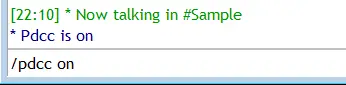

/pdcc
=====

The /pdcc command attempts to speed up the mIRC DCC send feature by sending packets ahead of acks, or acknowledgements.

Synopsis
--------

.. code:: text

    /pdcc [on|off]

Switches
--------

None

Parameters
----------

.. list-table::
    :widths: 15 85
    :header-rows: 1

    * - Parameter
      - Description
    * - ON
      - Enables DCC pumping.
    * - OFF
      - Disables DCC pumping.

.. note:: If no parameter is specified, mIRC will simply echo to the main screen the status of DCC send pumps, eg: whether they are ON or OFF.

Example
-------

.. code:: text

    /pdcc ON

Compatibility
-------------

.. compatibility:: 3.3

See also
--------