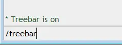

/treebar
========

/treebar is used to enable or disable the mIRC treebar.

Synopsis
--------

.. code:: text

    /treebar [on|off]

Switches
--------

None 

Parameters
----------

.. list-table::
    :widths: 15 85
    :header-rows: 1

    * - Parameter
      - Description
    * - on
      - Enable the mIRC treebar.
    * - off
      - Disable the mIRC treebar.

Examples
--------

Enable the treebar

.. code:: text

    /treebar on

Disable the treebar

.. code:: text

    /treebar off

View the treebar status

.. code:: text

    /treebar

The above command will result in the following:

.. note:: The treebar cannot be disabled while in Compact mode.

Compatibility
-------------

.. compatibility:: 6.2

See also
--------

.. hlist::
    :columns: 4

    * :doc:`$treebar </identifiers/treebar>`

