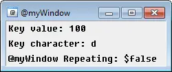

On Char
=======

The ON Char event is triggered when a character results from pressing one or more inside of a custom custom windows - mIRC|@window.

See the note about the :doc:`on keydown </events/on_keydown>` event, pressing control + o should result in two keypress being reported from on keydown, and control + o generates the character with code point 15, on char will trigger for that character.

This event fills the following identifiers:

.. list-table::
    :widths: 15 85
    :header-rows: 1

    * - Identifier
      - Description
    * - :doc:`$keyval </identifiers/keyval>`
      - The unicode codepoint of the character resulting from keypresses
    * - :doc:`$keychar </identifiers/keychar>`
      - The actual character resulting from keypresses
    * - :doc:`$keyrpt </identifiers/keyrpt>`
      - If the key is being held down/repeating

Synopsis
--------

.. code:: text

    ON <level>:char:<@>:<codepoint,...,codepointN>:<commands>

Parameters
----------

.. list-table::
    :widths: 15 85
    :header-rows: 1

    * - Parameter
      - Description
    * - <level>
      - The level for the event to trigger.
    * - <@>
      - The custom windows where this event should listen. Can be @ for all windows.
    * - <codepoint>
      - The specific characters' codepoints to listen for. Can specify multiple codepoints, such as:

.. code:: text

    ON *:char:@myWindow:38,42,55,78:echo -a $keyval

Example
-------

Create an alias that launches a custom, :ref:`picture_windows` which listens for resulting character from keypresses and displays the character and if it is repeating:

.. code:: text

    alias keyDownTest {
      window -p $+ $iif($window(@myWindow),ra) @myWindow 550 300 250 105
    }
    ON *:char:@myWindow:*: {
      clear @myWindow
      drawtext @myWindow 1 3 3 Codepoint value: $iif($keyval,$v1,NA)
      drawtext @myWindow 1 3 25 Character: $iif($keychar,$v1,NA)
      drawtext @myWindow 1 3 47 Repeating: $keyrpt
    }

The following command can now be typed into any mIRC command prompt:

.. code:: text

    /keyDownTest

Below is an image reflecting what this example will look like:

Compatibility
-------------

.. compatibility:: 7.62

See also
--------

.. hlist::
    :columns: 4

    * :doc:`on keydown </events/on_keydown>`
    * :doc:`on keyup </events/on_keyup>`
    * :doc:`$keyval </identifiers/keyval>`
    * :doc:`$keychar </identifiers/keychar>`
    * :doc:`$keyrpt </identifiers/keyrpt>`

