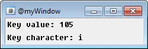

On Keyup
========

The ON KEYUP event is triggered when a key has been pressed, but subsequently released, inside of a custom {{mirc|custom windows|@window}}.

This event fills the following identifiers:

.. list-table::
    :widths: 15 85
    :header-rows: 1

    * - Identifier
      - Description
    * - :doc:`$keyval </identifiers/keyval>`
      - The Windows keycode value of the key being released, see https://docs.microsoft.com/en-us/windows/win32/inputdev/virtual-key-codes for a list of keycodes
    * - :doc:`$keychar </identifiers/keychar>`
      - The actual character released, this is not useful and you should not be relying on this, it won't work when you needed two keypresses to get the character
    * - :doc:`$keyrpt </identifiers/keyrpt>`
      - it always returns $true

Synopsis
--------

.. code:: text

    ON <level>:KEYUP:<@>:<keycode,...,keycodeN>:<commands>

Parameters
----------

.. list-table::
    :widths: 15 85
    :header-rows: 1

    * - Parameter
      - Description
    * - <level>
      - The level for the event to trigger.
    * - <@>
      - The custom window where this event should listen. Can be @ for all windows.
    * - <keycodes>
      - The specific key, or keys to listen for. Can specify multiple keys, such as:

.. code:: text

    ON *:KEYUP:@myWindow:38,42,55,78:echo -a $keyval

Example
-------

Create an alias that launches a custom, :ref:`picture_windows` which listens for key releases and displays the key value released, and the key character released:

.. code:: text

    alias keyUpTest {
      window -p $+ $iif($window(@myWindow),ra) @myWindow 550 300 250 83
    }
    ON *:KEYUP:@myWindow:*: {
      clear @myWindow
      drawtext @myWindow 1 3 3 Keycode value: $iif($keyval,$v1,NA)
      drawtext @myWindow 1 3 25 character: $iif($keychar,$v1,NA)
    }

The following command can now be typed into any mIRC command prompt:

.. code:: text

    /keyUpTest

Below is an image reflecting what this example will look like:

.. note:: This makes use of a :ref:`picture_windows`, as well as the :doc:`drawtext command </commands/drawtext>`. These types of :ref:`picture_windows` and their tools can be very powerful in creating some amazing graphical layouts, as well as mIRC games.

Compatibility
-------------

.. compatibility:: 5.8

See also
--------

.. hlist::
    :columns: 4

    * :doc:`/drawtext </commands/drawtext>`
    * :doc:`on keydown </events/on_keydown>`
    * :doc:`$keyval </identifiers/keyval>`
    * :doc:`$keychar </identifiers/keychar>`
    * :doc:`$keyrpt </identifiers/keyrpt>`

