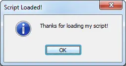

On Load
=======

The ON LOAD event is ran whenever a script is first loaded into mIRC's remotes section. Only one of these events may exist per script file.

Synopsis
--------

.. code:: text

    ON <level>:LOAD:<commands>

Parameters
----------

.. list-table::
    :widths: 15 85
    :header-rows: 1

    * - Parameter
      - Description
    * - <level>
      - The level for the event to trigger.
    * - <commands>
      - The commands to be performed when the event listener's criteria is met.

Example
-------

When the following script is loaded, it will give the user an :doc:`$input </identifiers/input>` popup greeting:

.. code:: text

    ON *:LOAD:noop $input(Thanks for loading my script!,oi,Script Loaded!)

.. note:: The above example can be executed directly from an mIRC command-line, without the ON LOAD event, by typing:

.. code:: text

    //noop $input(Thanks for loading my script!,oi,Script Loaded!)

The following is what the above will look like upon loading the script for the first time:

Compatibility
-------------

.. compatibility:: 2.1a

See also
--------

.. hlist::
    :columns: 4

    * :doc:`on start </events/on_start>`
    * :doc:`on unload </events/on_unload>`
    * :doc:`/load </commands/load>`
    * :doc:`/unload </commands/unload>`

