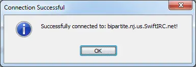

On Logon
========

The ON LOGON event triggers immediately after mIRC has begun connection to a server, and has sent the standard PASS, NICK and USER to the server.

.. note:: This event can be prefixed with the ^ character to cause the event to trigger *before* the PASS, NICK and USER is sent to the server. Utilizing this ^ character, the events can even be :doc:`halted </commands/halt>`, and no information sent to the server; this will most-likely cause a connection interruption, or disconnection entirely.

Synopsis
--------

.. code:: text

    on <level>:logon:<servername>:<commands>

Parameters
----------

.. list-table::
    :widths: 15 85
    :header-rows: 1

    * - Parameter
      - Description
    * - <level>
      - The level for the event to trigger.
    * - <servername>
      - this parameter is based on the network name. If a network name cannot be found, it uses the group name, and if that cannot be found, it uses the server address as a last resort. Can be a :ref:`matching_tools-wildcard`. The order is important, for example if you use an ip address for this parameter and connect the first time, it will trigger, but mIRC will associate a network value and the network will be used next time, which wouldn't match the ip address, you can use * for this parameter and handle :doc:`$servertarget </identifiers/servertarget>` to tie the event to a specific server target value.
    * - <commands>
      - The commands to be performed when the event listener's criteria is met.

Examples
--------

Echo to the active window some information before the login information is sent, using the ^ prefix:

.. code:: text

    on ^*:logon:*:echo -a Connecting to $server through the $network network...

Create a popup window which shows up after a successful connection is established:

.. code:: text

    on ^*:logon:*:noop $input(Successfully connected to: $server $+ !,io,Connection Successful)

The event above will generate a popup-window much like the one in the screenshot below:

Compatibility
-------------

.. compatibility:: 6.03

See also
--------

.. hlist::
    :columns: 4

    * :doc:`on connect </events/on_connect>`
    * :doc:`on disconnect </events/on_disconnect>`
    * :doc:`on quit </events/on_quit>`
    * :doc:`/disconnect </commands/disconnect>`
    * :doc:`/quit </commands/quit>`
    * :doc:`/server </commands/server>`

