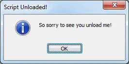

On Unload
=========

The ON UNLOAD event is ran whenever a script is unloaded from mIRC's remotes section. Only one of these events may exist per script file.

Synopsis
--------

.. code:: text

    ON <level>:UNLOAD:<commands>

Parameters
----------

.. list-table::
    :widths: 15 85
    :header-rows: 1

    * - Parameter
      - Description
    * - <level>
      - The level for the event to trigger.
    * - <commands>
      - The commands to be performed when the event listener's criteria is met.

Example
-------

When the following script is unloaded, it will give the user an :doc:`$input </identifiers/input>` popup:

.. code:: text

    ON *:UNLOAD:noop $input(So sorry to see you unload me!,oi,Script Unloaded!)

.. note:: The above example can be executed directly from an mIRC command-line, without the ON UNLOAD event, by typing:

.. code:: text

    //noop $input(So sorry to see you unload me!,oi,Script Unloaded!)

The following is what the above will look like upon unloading the script:

Compatibility
-------------

.. compatibility:: 2.1a

See also
--------

.. hlist::
    :columns: 4

    * :doc:`on load </events/on_load>`
    * :doc:`on start </events/on_start>`
    * :doc:`/load </commands/load>`
    * :doc:`/unload </commands/unload>`

