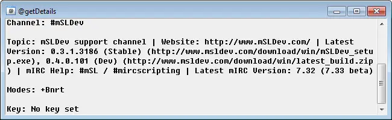

$chan
=====

The $chan identifier is filled during events which trigger on a channel.

The $chan identifier can also be used to get information regarding a specific channel the local mIRC client is in.

Synopsis
--------

.. code:: text

    $chan[(@wid/#/N).property]

Parameters
----------

.. list-table::
    :widths: 15 85
    :header-rows: 1

    * - Parameter
      - Description
    * - (@wid/#/N)
      - The window id of the channel, a specific channel, or a channel number referencing the channel.

Properties
----------

.. list-table::
    :widths: 15 85
    :header-rows: 1

    * - Property
      - Description
    * - banlist
      - Returns :doc:`$true </identifiers/true>` if mode +b has been seen already, or :doc:`$false </identifiers/false>` if not, or  :doc:`$inmode </identifiers/inmode>` if currently in a mode +b listing.
    * - cid
      - Returns the connection ID for the channel.
    * - hwnd
      - Returns the Operating system|operating system's actual hWnd|window handle for the channel.
    * - ial
      - Returns :doc:`$true </identifiers/true>` or :doc:`$false </identifiers/false>` if the IAL has been updated for the channel.
    * - ibl
      - Returns the same as banlist
    * - iql
      - Returns :doc:`$true </identifiers/true>` or :doc:`$false </identifiers/false>` if the IQL has been updated for the channel
    * - idle
      - Returns the amount of time the channel has been idle. This does not include entries made from the local mIRC client.
    * - iel
      - Returns :doc:`$true </identifiers/true>` or :doc:`$false </identifiers/false>` if the local mIRC client is on the channel's internal exempt list.
    * - iil
      - Returns :doc:`$true </identifiers/true>` or :doc:`$false </identifiers/false>` if local mIRC client is on the channel's internal invite list.
    * - inwho
      - Returns :doc:`$true </identifiers/true>` or :doc:`$false </identifiers/false>` if a /who command - mIRC|/who command has been performed on the channel, and the results are still being processed.
    * - key
      - Returns the channel's key.
    * - limit
      - Returns the amount of users the channel is limited to.
    * - logfile
      - Returns the location of the current channel's log file - mIRC|log file, if any.
    * - mode
      - Returns the current modes set in the channel.
    * - stamp
      - Returns :doc:`$true </identifiers/true>` or :doc:`$false </identifiers/false>` if time stamping - mIRC|time stamping is enabled on the channel.
    * - status
      - Returns: joining, joined, or kicked.
    * - topic
      - Returns the channel topic.
    * - wid
      - Returns the mIRC application's window id for the channel window.

Examples
--------

Create an alias that opens a Custom windows - mIRC|custom @window which loads some basic information about the active channel:

.. code:: text

    alias getDetails {
      if ($active ischan) {
      var %c = $active
        window @getDetails 350 350 650 200
        clear @getDetails
        echo @getDetails Channel: %c
        echo @getDetails $crlf $crlf
        echo @getDetails Topic: $chan(%c).topic
        echo @getDetails $crlf $crlf
        echo @getDetails Modes: $chan(%c).mode
        echo @getDetails $crlf $crlf
        echo @getDetails Key: $iif($chan(%c).key,$v1,No key set)
      }
    }

This Aliases - mIRC|custom alias can now be executed using the following command in a channel command-line:

.. code:: text

    /getDetails

The results of this command will look similar to the results below:

Compatibility
-------------

.. compatibility:: 4.7

See also
--------

.. hlist::
    :columns: 4

    * :doc:`on join </events/on_join>`
    * :doc:`on part </events/on_part>`
    * :doc:`$ial </identifiers/ial>`
    * :doc:`$ibl </identifiers/ibl>`
    * :doc:`$nick </identifiers/nick>`

