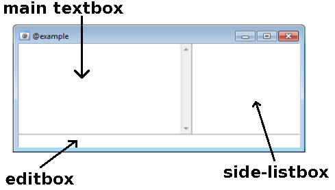
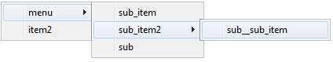
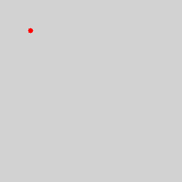
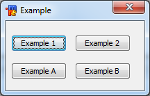

GUI Scripting
=============

Custom Windows
--------------

Prior to mIRC 5.5, **Custom Windows** was the main method for making a GUI (graphical user interface).

A custom window is just another window, like a channel window or a server window but with the added ability to control every aspect of it. The following commands allow you to modify, add, and change things in that custom window of yours.

Window Components
~~~~~~~~~~~~~~~~~

A custom window has the ability to contain the following 3 components:

Creating A Window
~~~~~~~~~~~~~~~~~

Before you can do anything with a window, you must actually create it. All windows must have a name, their name must also start with the '@' symbol. The name can be anything as long as it doesn't contain spaces. Use the /window command to create a window:

.. code:: text

   /window @<WindowName> [x y [w h]]

This will create a blank window containing only the chatbox. If you'd like to add the editbox you'd need to use the -e switch. Placing a number after the switch allows you to define what kind of editbox to be used: 0 - single line, 1 - multi-line editbox, 2 - auto editbox, 3 - default. A window can also be made to be detached from the main window using the -d switch.

.. code:: text

   /window -e[N] @<WindowName> [x y [w h]]

A size-listbox can also be added to the window using the -l switch. Adding a number after the 'l' will define the width (in characters) of the listbox.

.. code:: text

   /window -l[N] @<WindowName> [x y [w h]]

For example:

.. code:: text

   alias example {
     ; -d desktop window, -e editbox, (3 = auto), -l = side-editbox (20-char width)
     ; position (200,200) size 500x350
     window -de3l20 @example 200 200 500 350
   }

The code above will create a desktop window with an editbox and a side-listbox.

Text Operations
~~~~~~~~~~~~~~~

The following commands can be used to add, modify, delete, insert, or replace the lines in the chatbox or the side-listbox:

-  **Add a line** - This command will simply add a line of text to the end of the window. The [color] is the color number for the line. The -n switch can be used to prevent from adding duplicates. The -i indents the line.

  .. code:: text

      /aline [-ni] [color] <@name> <text>

-  **Delete a line** - This command is used to delete the Nth line from the window. The N2 line can be specified to give a range of line ex: 4-7 will delete line 4, 5, 6, and 7.
   
  .. code:: text

      /dline [color] <@name> <N[-N2]>

-  **Insert a line** - This command allows you to add a line of text after the Nth line. The [color] is the color number for the line. The -n switch can be used to prevent from adding duplicates. The -i indents the line.
   
  .. code:: text

      /iline [-ni] [color] <@name> <N> <text>

-  **Replace a line** - This command is used to replace the Nth line of a window with another line. The [color] is the color number for the line.
   
  .. code:: text

      /rline [color] <@name> <N> <text>

-  **Change color of a line** - This command is used to change the color of the Nth line with the new [color]. The -m switch can be used to associate nickname color in side-listbox with the nickname in the chatbox. The -r switch can be used to reset the color back to default.
   
  .. code:: text

      /cline [-rm] [color] <@name> <N>

-  **Select a line** - This command is used to select the Nth line of window. The -p switch can be used to force the line of text to be wrapped if it's too long to fit on one line. -h highlights the window's icon (only if its minimized). -a can be used to add this line to the current selection and -s can be used to clear the current selection and select just this line.
   
  .. code:: text

      /sline [color] <@name> <N>

Customizing The Window
~~~~~~~~~~~~~~~~~~~~~~

The titlebar command can be used to change the window's title.

.. code:: text

   /titlebar @window <text>

.. note:: This will not change the actual @window name, only its title. To change the actual window's name, use the renwin command:

.. code:: text

   /renwin <@oldname> <@newname> [topic]

Custom Window's Menu
~~~~~~~~~~~~~~~~~~~~

You can also create a customized right click menu for the window, this can be done using one of the two ways:

#. Plain text file (must be named "POPUP.TXT") which will contain the menu;
#. Coding the menu in the remote section.

The first option is using a popup file. This method is very much like the popups tab in the script editor. In the code below we will assume you are going with option 2, writing it in the remote section. If you choose to go with a popup file, you will need to omit the "menu" keyword from your code. The basic syntax is:

.. code:: text

   menu @windowName {
     <event>: {
       ;/commands
     }
     ;or
     <event>: /commands
   }

There are 8 possible built-in events; however, only 3 of them pertain to regular custom windows (the rest can only be used in a Picture Window.

-  **dclick** - Triggers when a mouse has double clicked on the window.
-  **rclick** - Triggers when a mouse right clicked on the window.
-  **lbclick** - Triggers when an item from the side-listbox was clicked.

In addition to built-in events, you can also add your own custom menu items.

.. note:: If you have built-in mouse events as well as custom menu items, the built-in events MUST be placed above the custom menu items. The basic syntax for the menu items is:

.. code:: text

   menu @windowName {
     item: {
       ;/commands
     }
     ;or
     item: /commands
   }

Sub menus and sub items are possible by prefixing the sub menu item with a period. Additional periods will indicate sub-sub menus. For example:

.. code:: text

   menu @example {
     menu  
     .sub_item: echo -a sub item clicked!
     .sub_item2
     ..sub__sub_item: echo -a sub sub item clicked!
     .sub: echo -a another item!
     item2: echo -a main item 2.
   }

will generate the following menu:

Getting Info
~~~~~~~~~~~~

There are a number of identifiers that can be used to retrieved information from a custom window.

The $window identifier can be used to retrieve window-specific information:

.. code:: text

   $window(@name | N )

Some of $window's more helpful properties are:

+----------------+----------------------------------------------------------------+
| Property       | Description                                                    |
+================+================================================================+
| x, y, w, h     | left, top, width, and height                                   |
+----------------+----------------------------------------------------------------+
| dx, dy, dw, dh | left, top, width and height position relative to the desktop   |
+----------------+----------------------------------------------------------------+
| state          | Returns the window's state (minimized/maximized/hidden/normal) |
+----------------+----------------------------------------------------------------+
| title          | Returns the window's title                                     |
+----------------+----------------------------------------------------------------+
| font           | Returns the window's font                                      |
+----------------+----------------------------------------------------------------+
| fontsize       | Returns the window's font size                                 |
+----------------+----------------------------------------------------------------+
| ontop          | Returns $true/$false if the window is set ontop                |
+----------------+----------------------------------------------------------------+
| wid            | Returns the window's ID                                        |
+----------------+----------------------------------------------------------------+
| sbtext         | Returns the switchbar button text                              |
+----------------+----------------------------------------------------------------+
| sbcolor        | Returns the switchbar highlight color                          |
+----------------+----------------------------------------------------------------+
| sbstate        | Returns the switchbar button state                             |
+----------------+----------------------------------------------------------------+
| tdbstate       | Returns the treebar button state                               |
+----------------+----------------------------------------------------------------+

Retrieving Text
~~~~~~~~~~~~~~~

You can retrieve a line of text from a custom window using the $line identifier:

.. code:: text

   $line(@windowName, N, T)

$lines returns the Nth line of text from a window. If N = 0, $lines returns the total number of lines in the window. If T = 1, the side-listbox will be used instead of the chatbox (default is 0).

You can also search the window for a line wild-matching a specific sequence.

.. code:: text

   $fline(@windowName, wildtext, N, T)

This will return the Nth line wild-matching a specific wildtext sequence. If T = 1, the side-listbox will be used instead of the chatbox (default is 0).

If a listbox is used, you can use the $sline identifier to retrieve the Nth selected text.

.. code:: text

   $sline(@windowName, N)[.ln]

If N = 0, the total number of selected lines is returned. If the .ln property is used, the line number will be returned instead of the actual text.

Picture Windows
---------------

**Picture Windows** in mIRC are a special type of custom windows that is used as a drawing canvas. mIRC provides a set of commands, identifiers, and events for manipulating them. Picture windows provide an alternative mean of creating a graphical user interface.

Creating A Picture Window
~~~~~~~~~~~~~~~~~~~~~~~~~

Picture windows can be created via the /window command in combination with the -p switch which creates a bitmap.

.. note:: -p only creates the bitmap, the size used in /window will by default set the window's size, to sets the size of the bitmap, you need to use the -f switch, which will automatically resize the size of the window for you.

.. note:: One way to get a window size bigger than your actual maximum screen resolution is to open the window once using the switches +Lt and then to call /window -f again with the actual width and height.

A simple example:

.. code:: text

   //window -dep @example -1 -1 500 400

will create a desktop picture window named @example with an editbox and a size of 500x400, the actual size of the bitmap is not 500*400, it will be close, you can check its size with:

.. code:: text

   //echo -a $window(@example).bw $window(@example).bh

A better example would be:

.. code:: text

   //window -dfep @example -1 -1 500 400

Now the bitmap has the desired size.

Drawing
~~~~~~~

There are 11 commands to draw to a picture window, all of them support the -n switch, which prevents mIRC from painting the change you just made to that window, this allows you to make smooth draws: if you make several draws at the same time or periodically without using the -n switch, you'll see a flicker between the draw, using -n on all your draws and then allowing mIRC to paint the changes 'merged' once will get rid of these flickers, it is not faster to draw with -n and vice versa.

Once you have made all your draws and are ready to paint the changes, any call to one of these /draw commands without the -n switch will do it (makes sense when we know not using the -n switch always paint the changes, causing flickers). You naturally want to use the simple /drawdot @mywin for that.

.. note:: This section won't give full details about the commands, click on a command to see more informations about that command.

/drawdot can be used to draw dots at specific coordinates with a specific size and color.

/drawline can be used to draw lines at specific coordinates with a specific size and color, if more than four points are given, the next line is drawn from the end of the last line to that point, chaining lines.

/drawrect can be used to draw rectangles or ellipses at specific coordinates with a specific size and color, you can specify more than one set of coordinate and size parameters and they are drawn seperately.

/drawfill can be used to fill an area with the specified color starting at a specific coordinate, you can either use this to keep filling as long as the color is the one you specified (surface fill) or to keep filling as long as the color is not the one you specified (border fill).

/drawtext can be used to draw text at the specified coordinate, using the specified font name and font size, it supports basic formating via switches.

/drawsave which actually can't be used to draw to a bitmap, is used to save an area to a .bmp or .jpg file.

/drawscroll can be used to scroll an area inside rectangles by specific distances, you can specify more than one set of scrolling area and distances.

/drawcopy can be used to copy an area to a specific coordinate from a window to another (can be the same window).

/drawpic can be used to load and draw a picture file at a specific coordinates, the file can be an icon from an ico/exe/dll file.

/drawrot can be used to rotate an area by a specific angle.

/drawreplace can be used to replace a color with another in a specific area

/draw\* Example
~~~~~~~~~~~~~~~

Here is a simple alias using all of the command above except /drawsave and /drawpic.

.. code:: text

   alias picwin_example {
   window -dpfB @test -1 -1 300 300
   ;draw a red dot (rgb = 255), size = 5, x y = 50 50
   drawdot -r @test 255 5 50 50
   ;draw a red line size = 3, first point = 25 50, second point 75 50
   .timer 1 2 drawline -r @test 255 3 25 50 75 50
   ;draw a non filled red rectangle, size = 8, x y w h = 25 25 75 75
   .timer 1 4 drawrect -r @test 255 8 25 25 75 75
   ;fill the whole window with a border fill: as long as the starting pixel(0 0)'s color isn't the border color (255), that pixel is made the filling color (rgb = 12345, green)
   .timer 1 6 drawfill -r @test 1234567 255 0 0
   ;draw "test" in rgb color 65498, at coordinate 65 65, font name verdana and font size 12
   .timer 1 8 drawtext -r @test 65498 verdana 12 65 65 test
   ;scroll the whole window, by 30 pixels on the right, and 20 pixels upward
   .timer 1 10 drawscroll @test 30 -20 0 0 300 300
   ;copy the rectangle '50 50 100 100' at coordinate '200 60'
   .timer 1 12 drawcopy @test 50 50 100 100 @test 200 60
   ;rotate the whole window by 12°
   .timer 1 14 drawrot -m @test 12
   ;replace all the pixel with the rgb color 255 by the rgb color 6598743
   .timer 1 16 drawreplace -r @test 255 6598743
   }

Result in:

Mouse Events
~~~~~~~~~~~~

Mouse events can be defined in a script menu definition, a picture window support the following mouse events:

-  **mouse** - mouse moved at a new coordinate, you can check $mouse.x and $mouse.y to get the new coordinate of the mouse.
-  **sclick** - clicked at $mouse.x $mouse.y.
-  **dclick** - double clicked at $mouse.x $mouse.y.
-  **uclick** - mouse released at $mouse.x $mouse.y.
-  **rclick** - right clicked at $mouse.x $mouse.y.
-  **lbclick** - selected a line in the listbox, you can check $1 to get the line number of the selected line.
-  **leave** - mouse left the window, you can check $leftwin if the menu doesn't trigger for a static name.
-  **drop** - mouse drag and dropped at $mouse.x $mouse.y.

Keyboard Events
~~~~~~~~~~~~~~~

You can catch keyboard input using the ON KEYDOWN and ON KEYUP events, which triggers when a key is pressed and released respectively.

Synopsis: on on <level>:<keydown|keyup>:<@window>:<keys>:<command>

Can be a comma sepereated list of key, which are nothing more than number, representing a key, $keyval returns the key code while $keychar returns the actual character of the key. $keyrpt returns $true if the event is triggering because the key is being held down (on keydown only).

The $mouse Identifier
~~~~~~~~~~~~~~~~~~~~~

The $mouse identifier doesn't take any parameter, but has the following properties:

Indirect Events
^^^^^^^^^^^^^^^

Using $mouse.key, you get a value when using the AND operator, yielding useful information:

-  if ($mouse.key & 1) is true if the left mouse button is pressed.
-  if ($mouse.key & 2) is true if the control key is pressed.
-  if ($mouse.key & 4) is true if the shift key is pressed.
-  if ($mouse.key & 8) is true if the alt key is pressed.
-  if ($mouse.key & 16) is true if the right mouse button is pressed.

Other useful properties:

-  **.win** - returns the name of the active window.
-  **.x & .y** - returns the coordinate of the mouse on the x/y axis, relative to the active window.
-  **.mx & .my** - returns the coordinate of the mouse on the x/y axis, relative to the main mIRC window.
-  **.dx & .dy** - returns the coordinate of the mouse on the x/y axis, relative to the desktop.
-  **.lb** - returns $true if a mouse event occured over a listbox, $false if it did not.

The $click Identifier
~~~~~~~~~~~~~~~~~~~~~~~~~~~~~~~~~~

Synopsis: $click(@window,N)

mIRC store a history of x,y value when you click on a window, $click() returns the Nth x,y click.

The $inellipse Identifier
~~~~~~~~~~~~~~~~~~~~~~~~~~~~~~~~~~~~~~~~~~

Synopsis: $inellipse(x,y,x,y,w,h)

Returns $true if the first point x y is inside the ellipse specified by the 'x y w h' parameters, and $false if it is not.

The $inrect Identifier
~~~~~~~~~~~~~~~~~~~~~~~~~~~~~~~~~~~~

Synopsis: $inrect(x,y,x,y,w,h)

Returns $true if the first point x y is inside the rectangle specified by the 'x y w h' parameters, and $false if it is not.

The $inroundrect Identifier
~~~~~~~~~~~~~~~~~~~~~~~~~~~~~~~~~~~~~~~~~~~~~~

Synopsis: $inroundrect(x,y,x,y,w,h,w,h)

Returns $true if the first point x y is inside the rounded rectangle specified by the 'x y w h' parameters, where the extra 'w h' parameters represent the value used in /drawrect to get the rounded corner, and $false if it is not.

The $inpoly Identifier
~~~~~~~~~~~~~~~~~~~~~~~~~~~~~~~~~~~~

Synopsis: $inpoly(x,y,x1,y1,x2,y2,...)

Returns $true if the first point x y is inside the polygon defined by the specified points 'x1 y1 x2 y2 ...' parameters, and $false if it is not.

The $onpoly Identifier
~~~~~~~~~~~~~~~~~~~~~~~~~~~~~~~~~~~~

Synopsis: $onpoly(n1,n2,x1,y1,x2,y2,x3,y3,...)

Returns $true if two polygon overlap, $false otherwise. The first n1 and n2 parameters represent the number of points in the first and in the second polygon respectively. The rest of the parameters are the x,y points used for each polygon.

The $rgb Identifier
~~~~~~~~~~~~~~~~~~~~~~~~~~~~~~

Synopsis: $rgb(R,G,B), $rgb(N)

$rgb(R,G,B) returns the RGB value formed with the specified Red, Green and Blue values.

$rgb(N) return the R,G,B format used to form the specified RGB color value.

The $getdot Identifier
~~~~~~~~~~~~~~~~~~~~~~~~~~~~~~~~~~~~

Synopsis: $getdot(@window,x,y)

Returns the RGB value of the pixel at the specified coordinate in the specified window.

The $height Identifier
~~~~~~~~~~~~~~~~~~~~~~~~~~~~~~~~~~~~

Synopsis: $height(@text,fontname,fontsize)

Returns height of text in pixels for the specified font.

The $width Identifier
~~~~~~~~~~~~~~~~~~~~~~~~~~~~~~~~~~

Synopsis: $width(text,fontname,fontsize,B,C)

Returns width of text in pixels for the specified font, B can be non zero for a bold font, C can be non zero if you want control codes to be processed.

The $window Identifier
~~~~~~~~~~~~~~~~~~~~~~~~~~~~~~~~~~~~

Synopsis: $window, $window(<@<name|wid>|N>,N)

**$window** itself returns the name of the window which was just left in the **leave** mouse event in a menu definition.

When used with arguments, if you use a name, it can be a wildcard and can be used with the N parameter to represent the Nth window matching. As far as picture window are concerned, $window() has only one couple of properties you can use, **.bw & .bh** will return the width & height of the bitmap.

The $pic Identifier
~~~~~~~~~~~~~~~~~~~~~~~~~~~~~~

Synopsis: $pic(filename).[height|width|size]

Can return the size, width and height of a .bmp, .jpg or .png file

Dialogs
-------

**Dialogs** make it possible to create custom dialog windows inside of mIRC. The /dialog command opens new dialogs, and the dialog components are the objects within the dialog, such as buttons, labels, etc.

What Are Dialogs?
~~~~~~~~~~~~~~~~~

Dialogs are simply graphical user interfaces that present options to a user's screen in a graphical form. For instance, a web browser is display through its own dialog. Windows users may have used applications such as notepad, or Microsoft Word. All of these applications use dialogs, or forms of graphical user interfaces to present their applications in an appealing form.

mIRC Dialogs
~~~~~~~~~~~~

mIRC dialogs are created by users through custom scripts. Through these dialog interactions, the dialogs adhere to an event listener, the on dialog event. Through this event, all aspects of the custom dialogs, as well as their controls, can be monitored, tracked, and modified.

Scope
~~~~~

The scope of this article is to generally familiarize users with the term **dialogs**, and what exactly it is they are used for within mIRC. Since these components are geared towards more advanced scripters, beginners should make sure they have already gone through the preceding tutorials from the bootcamp page, all the way leading up to **Dialogs**.

Two Types Of Dialog
~~~~~~~~~~~~~~~~~~~

They are two type of dialogs - modal dialogs which block access to other parts of the mIRC interface until they are closed, and modeless dialogs which can be left open whilst continuing to allow access to the rest of mIRC (i.e. effectively a separate mIRC-based window).

Modals dialog are dialog which block the current script execution, you cannot access other windows, usually used to get a quick user input. mIRC has built-in modals dialog, $?'s families and $input are modals dialogs.

Modeless dialog can be opened indefinitely and does not halt the script execution.

Modeless Dialog
^^^^^^^^^^^^^^^

You can create a modeless dialog using the /dialog command with the -m switch, there are other switch that can be used at creation time and after the creation of the dialog to change various states.

.. code:: text

   /dialog -m <name> <table>

<name> is the name used to reference the instance of the dialog. (You can run multiple instance of the same dialog at the same time.)

<table> is the name of the dialog table to use.

Modal Dialog
^^^^^^^^^^^^

You can create a modal dialog using the $dialog identifier with the following syntax:

.. code:: text

  $dialog(name,table[,parent])

-  name - The name used to reference the instance of the dialog
-  table - The name of the dialog table to use
-  parent - Optional, this can be a window name or:

   -  -1 - Desktop window
   -  -2 - Main mIRC window
   -  -3 - Current active window
   -  -4 - Current active dialog if no dialog is open
   -  The default is -3.

Any control can be used in the dialog with the "result" style, the value returned by $dialog is be the value of that control.

.. note:: Since modal dialog block the current script execution, you cannot call $dialog that way from a remote script event.

Creating A Dialog Table
~~~~~~~~~~~~~~~~~~~~~~~

Custom dialogs are created by defining a dialog table, the content of that table represents the look of the dialog, the controls etc, a table is defined by using the keyword:

.. code:: text

   dialog -l <name> {

       title        "text"

       icon         filename, index

       size         x y w h

       option       type                                   (pixels, dbu, map, notheme, disable)

       text         "text", id, x y w h, style             (right, center, nowrap)

       edit         "text", id, x y w h, style             (right, center, multi, pass, read, return, hsbar, vsbar, autohs, autovs, limit N, rich)

       button       "text", id, x y w h, style             (default, ok, cancel, flat, multi)

       check        "text", id, x y w h, style             (left, push, 3state)

       radio        "text", id, x y w h, style             (left, push)

       box          "text", id, x y w h, style

       scroll       "text", id, x y w h, style             (top left bottom right horizontal range N N)

       list         id, x y w h, style                     (sort, extsel, multsel, size, vsbar, hsbar, check, radio)

       combo        id, x y w h, style                     (sort, edit, drop, size, vsbar, hsbar)

       icon         id, x y w h, filename, index, style    (noborder top left bottom right small large actual)

       link         "text", id, x y w h

       tab          "text", id, x y w h

       tab          "text", id 

       menu         "text", menuid [, menuid]

       item         "text", id [, menuid]

       item         break, id [, menuid]

   }

The -l switch makes the table local, only that script file can open it. \<name\> is the name of table which will be used to create an instance of that dialog

-  title - Optional, can be used to set the text displayed in the titlebar of the dialog
-  icon - Optional, can be used to set the icon of the dialog, the filename parameter is the filename to use for the icon, the index parameter can be used to specify the Nth icon from a file
-  size - Required, set the size of the dialog, you can use -1 for any of the x, y, w and h parameter to specify a default position, x and y sets as -1 should center the dialog in the window
-  option - Can be used to set different options for the dialog, type is a space seperated list of options:

   -  pixels - x y w h values are in pixels - this is the default option if you don't use the dbu or map options.
   -  dbu - x y w h values are in dialog base units (DBUs) - this option attempts to make the dialog look the same on any size display - however anecdotal evidence suggests that there are issues with DBU when user has Windows 10 Settings / System / Display / Scaling set to > 100%.
   -  map - x y w h values are in MAP units - this (undocumented) option will also try to ensure that the dialog looks the same under any size display even when Windows 10 Display Scaling is > 100%. MAP units are **not** the same as DBUs and you will have to recalculate x y w & h values if you switch from DBU to MAP. There are no MAP equivalents for $dbuw and $dbuh identifiers.
   -  notheme - This option prevents mIRC from applying your current windows theme to the dialog - if you like your dialogs to have a retro Windows XP feel to them which is different to how the style used by the rest of mIRC, then this is the option for you.
   -  disable - This option can use used to wait a bit before the controls in the dialog can be used, preventing accidents

-  Other elements are used to create controls, see the dialog components

Remember that once the dialog is created, mIRC does not allow you to resize the controls in the dialog. You can use variable and identifiers inside the dialog table to create dialog control with dynamic size You can also use a variable name as a style for any control, the variable is set (global variable) with the value of that control when the dialog is closed:

.. code:: text

   ;use a variable to define the width and an identifier to define the height of the dialog, when the dialog is closed, %myedit will contain the content of the editbox.
   edit "", 2, 10 10 %dialog_width $dialog_height, autohs %myedit

Mnemonic
~~~~~~~~

The "text" parameter of controls showing text can include the '&' character to create a mnemonic. If you want to get the '&' rendered literaly, use &&.

.. note:: Even if a control renders the mnemonic correctly, the shortcut may not work, it's not working to switch tab for example.

For example, the following menu definition reproduces the File menu of the mIRC Editor dialog:

.. code:: text

   dialog test {
    title "mIRC"
    size -1 -1 110 100
    option dbu
    menu "&File", 60
    item "&New", 70
    menu "&Load", 80, 60
    item "&Script", 90
    item break, 100
    item "&Users", 110
    item "&Variables", 120
    item "&Unload", 130, 60
    item break, 140
    item "&Save", 150
    item "&Save As...", 160
    item "Save &All", 170
    item break, 180
    item "Save && &exit", 190, ok
    item "&Cancel", 200, cancel
   }

/did Command & $did Identifier
~~~~~~~~~~~~~~~~~~~~~~~~~~~~~~

The /did command can be used to change the various state of the control while $did can be used to retrieve values and states of controls.

Check the Dialog Components, which describe the usage of the two per control.

Other Tools
~~~~~~~~~~~~

/didtok, $didtok, $didwm And $didreg
^^^^^^^^^^^^^^^^^^^^^^^^^^^^^^^^^^^^

``/didtok <name> <id> <C> <text>`` will add a tokenized list of items to a list/combo/edit control, for example ``/didtok name 1 44 red,green,blue`` would add the item "red", "green", and "blue" to that control.

``$didtok(name,id,C)`` returns a tokenized list of item from a combo/edit/list control.

``$didwm(name,id,wildcard,N)`` and ``$didreg(name,id,regex,N)`` returns the number of the line that match the wildcard expression, starting at the optional line N, in the the control.

/loadbuf, /savebuf And /filter
^^^^^^^^^^^^^^^^^^^^^^^^^^^^^^

You can /filter from and to a combo/edit/list control.

You can /loadbuf and /savebuf from and to a combo/edit/list control.

Dialog Components
-----------------

.. list-table::
   :widths: 25 25 25 25
   :header-rows: 0

   * - Button
     - Check
     - Toggle
     - Text
   * - .. figure:: MIRCdlgButton_n.png
     - .. figure:: MIRCdlgCheck_n.png
     - .. figure:: MIRCdlgToggle_n.png
     - .. figure:: MIRCdlgLabel_n.png
   * - Group Box
     - Icon
     - Edit
     - Scroll
   * - .. figure:: MIRCdlgGroup_n.png
     - .. figure:: MIRCdlgImage_n.png
     - .. figure:: MIRCdlgText_n.png
     - .. figure:: MIRCdlgScroll_n.png
   * - Link
     - Menu
     - Radio
     - Tab
   * - .. figure:: MIRCdlgLink_n1.png
     - .. figure:: MIRCdlgMenu_n.png
     - .. figure:: MIRCdlgRadio_n.png
     - .. figure:: MIRCdlgTab_n.png
   * - List
     - Combo
     -
     -
   * - .. figure:: MIRCdlgList_n.png
     - .. figure:: MIRCdlgCombo_n.png
     -
     -

Button
~~~~~~
The button control is a user interface control that responds to click events.

Synopsis
^^^^^^^^
.. code:: text

	button "<text>", <id>, <x> <y> <width> <height>[, <style>]

Styles
^^^^^^

.. list-table:: 
	:widths: 50 50
	:header-rows: 1

	* - Style	
	  - Description
	* - default
	  - Sets the button to be the default button. This causes the button to be selected upon dialog creation.
	* - ok
	  - Sets the button to be the OK button. The OK button closes the dialog and in modal mode returns the return value set.
	* - cancel	
	  - Closes the dialog as if it was canceled – similar to clicking the X button.
	* - flat
	  - Creates a flat button (that depends on the OS and the theme used).
	* - multi
	  - Allows the text in the button to wrap around to multiple lines.
	* - disable
	  - Disables the button.
	* - hide
	  - Makes the button invisible.
	* - result
	  - In modal mode, returns the text of the button.

/did
^^^^

.. list-table::
	:widths: 50 50
	:header-rows: 1

	* - Switch
	  - Description
	* - -f
	  - sets focus on the button
	* - -t
	  - sets the button as the default button
	* - -e
	  - enables the button
	* - -b
	  - disables the button
	* - -v
	  - makes the button visible
	* - -h
	  - hides the button
	* - -r
	  - clears the button's text (caption)
	* - -a
	  - adds to the button's text (caption)

$did
^^^^

.. code:: text

	$did(<name>,<id>)[.property]

Without any property, returns the text (caption) of the button, same as the .text property

.. list-table::
	:widths: 50 50
	:header-rows: 1

	* - Property
	  - Description
	* - .text
	  - returns the text of the button (caption)
	* - .len
	  - returns the length of the button's text (caption)
	* - .next
	  - returns the id of the next control in order of tab keypress
	* - .prev
	  - returns the id of the previous control in order of tab keypress
	* - .visible
	  - returns $true if the button is visible, otherwise $false
	* - .enabled
	  - returns $true if the button is enabled, otherwise $false

Events
^^^^^^

.. list-table::
	:widths: 50 50
	:header-rows: 1

	* - Event
	  - Description
	* - sclick
	  - Triggers upon single click

Example
^^^^^^^

.. code:: text

	; init alias
	alias example {
	  dialog -m example example
	}
	; dialog structure
	dialog Example {
	  title "Example"
	  size -1 -1 100 50
	  option dbu
	  button "Example 1", 1, 4 10 40 12
	  button "Example 2", 2, 50 10 40 12
	  button "Example A", 3, 4 30 40 12
	  button "Example B", 4, 50 30 40 12, ok
	}
	; event
	on *:dialog:example:sclick:1-4:{
	  echo -a $did($dname, $did).text is clicked.
	}

