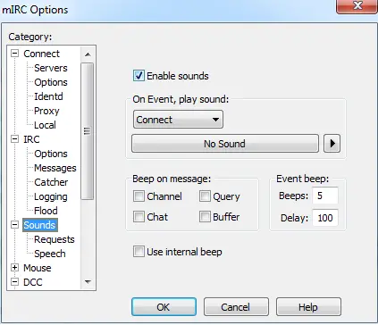

Playing Music
=============

Playing music in mIRC is really a very simple process, easily accomplished through the use of the :doc:`/splay </commands/splay>` command. mIRC can also be enhanced by other sounds, not just songs, as well. Depending on how you want your own, custom mIRC experience to be, whether you are a newbie or an advanced scripter, sounds are often added to events in mIRC by some scripters. Creating games in mIRC is an advanced type of script where sounds can greatly enhance a user's experience.

Enabling mIRC Sounds
--------------------

In order for you to be able to play music or any other type of sound in mIRC, you must first enable sounds. Sounds can be enabled simply by going to the options dialog (Alt+O), then clicking on the *Sounds* option in the left-hand side list, and then placing a check mark into the *Enable Sounds*. Below is a screenshot of the options window with the *Enable Sounds* option ticked.

.. note:: Alternatively, you may use the :doc:`/ebeeps </commands/ebeeps>` command to enable sounds in mIRC: ``/ebeeps on``

Supported Formats
-----------------

mIRC supports the following media formats: ``.wma,.mp3,.wav,.mid,.ogg``

.. note:: The ``.mp3,.wma & .ogg`` formats are all considered the same format when using the /splay command.

Multiple file formats can be played at the same time. However, you cannot play multiple files, of the same format, at the same time. For instance, you can play a .wav file at the same time as an .mp3 file, but you cannot play a .wav file and another .wav file at the same time. The second .wav file will take precedence if you're not queuing the file: the first .wav file will be stopped and the second one then played. Make sure to keep in mind what has been said regarding the formats ``.mp3,.wma & .ogg``; they are all treated the same with the :doc:`/splay </commands/splay>` command, so only one of those types may play at a time.

Synopsis
--------

.. code:: text

    /splay -cwmpq [filename | stop | pause | resume | seek | skip] [pos]

Switches
^^^^^^^^

.. list-table::
    :widths: 15 85
    :header-rows: 1

    * - Switches
      - Description
    * - -wmp
      - Indicates that the feature (only Stop or Skip features may be used with these flags) will be done on the specified media format that is currently playing.
    * - -w
      - WAVE format
    * - -m
      - MIDI format
    * - -p
      - MP3/OGG/WMA formats

.. note:: You may specify more than one of the above switches at the same time for the Stop feature, but not for Skip.

Parameters
^^^^^^^^^^

.. list-table::
    :widths: 15 85
    :header-rows: 1

    * - Parameters
      - Description
    * - -q
      - Adds the file to the queue for that format. The first file in the queue, for that format, is played when a song of that format ends its playback.
    * - [filename]
      - The file name for the sound file you wish to use. Typically, this only needs to be specified when you want to play or queue a file; other than those times, you would only use the flag for the sound file's type for manipulating how it acts.
    * - [stop|pause|resume|seek|skip]
      - Allows further control over a sound file that is currently playing. These flags' titles are their respective functions. These are discussed, in more detail, further down.
    * - [pos]
      - This optional parameter is used to point out the location in the music file, in milliseconds, for your sound to either start from or seek into.

Music Playing, Now What?
------------------------

After the music is playing, you have a few options available for manipulating the playback. If you are making a full Music Player, for example in a dialog form, these options are really helpful.

Playback Options
^^^^^^^^^^^^^^^^

.. list-table::
    :widths: 15 85
    :header-rows: 1

    * - Options
      - Description
    * - pause
      - ``/splay pause`` is used to pause the playing music
    * - resume 
      - ``/splay resume`` allows you to resume the paused music file
    * - stop 
      - ``/splay stop`` will stop the current music file.
    * - seek
      - ``/splay seek [pos]`` will go to a certain point in the music 
    * - skip
      - ``/splay skip`` allows you to skip the currently playing music file. If no other files are present in the queue for that particular sound type, no other file will play.

Volume Options
^^^^^^^^^^^^^^

You can control the volume of your system (and, therefore, of the music played in mIRC) with the :doc:`/vol </commands/vol>` command.

Synopsis
~~~~~~~~

.. code:: text

    /vol -wmpvuN [volume]

.. list-table::
    :widths: 15 85
    :header-rows: 1

    * - Flags
      - Description
    * - -w 
      - Changes the volume for WAV files only.
    * - -m
      - Changes the volume for MIDI files only.
    * - -p
      - Changes the volume for MP3/WMA/OGG only.
    * - -v 
      - Sets the master volume for the system, which increases volume across all levels.
    * - -uN 
      - Sets the mute setting: N = 1 turns the mute on, N = 2 turns the mute off.
    * - [volume]
      - A number indicating the volume, range from 0 (no sound) to 65535 (max).

Sound Finished, Now What?
-------------------------

After a sound file has finished playing, it will trigger an event. These events will not trigger for a file stopped with ``/splay stop`` or skipped with ``/splay skip`` commands, regardless of the switches/parameters used.

The ``ON MP3END``, ``ON WAVEEND`` & ``ON MIDIEND`` events will trigger for the ``.mp3,.wma,.ogg``, the ``.wav`` & the ``.mid`` formats, respectively. The *undocumented* ``ON SONGEND`` event will trigger for any of these five formats.

Synopsis
^^^^^^^^

.. code:: text

    on <level>:mp3end|midiend|waveend|songend:<commands>

The local identifier, :doc:`$filename </identifiers/filename>` will return the complete file name that has finished playing.

Any useful $identifier I can use?
---------------------------------

Of course! Here is the list:

.. list-table::
    :widths: 15 85
    :header-rows: 1

    * - Identifiers
      - Description
    * - $vol(<wave | midi | song | master>)
      - Returns a number between 0 and 65535 for the specified type. Property: If the ``.mute`` property is used, it returns a $true / $false value, the mute setting for that type.
    * - $inwave, $inmidi, $insong
      - Return $true if the specified wave, midi, mp3/wma/ogg type is playing, $false otherwise. Properties: ``.fname`` - Returns the complete filename; ``.pos`` - Returns the current position in the file; ``.length`` - Returns the length of the song; ``.pause`` - Returns $true if the song is paused.
    * - $sound(<type>)
      - Returns the directory specified in the Sound Requests section of the Options dialog, where type can be wave, midi, mp3, wma, or ogg.
    * - $sound(<filename>)
      - Returns either the directory for that file type, as above, or information about the sound file. Currently, only mp3 files are supported. Properties: ``.album, .title, .artist, .year, .comment, .genre, .track, .length, .version, .bitrate, .vbr, .sample, .mode, .copyright, .private, .crc, .id3, .tag, .tags`` The above properties always return the id3v1 values of the mp3 file. If you want to retrieve the id3v2 values, you can use the .tag and .tags properties:

.. code:: text

    alias showtags {
      if ($1- == $null) { echo 2 -e * /showtags: please specify filename, eg. /showtags file.mp3 | halt }
      echo 1 id3: $sound($1-).id3
      echo 1 tags: $sound($1-).tags
      var %n = $sound($1-,0).tag
      while (%n > 0) {
        echo 1 tag: $sound($1-,%n).tag
        dec %n
      }
    }

Examples
--------

.. code:: text

    ;Play the mp3 file, if an mp3 file is already playing, it is stopped before.
    /splay C:\Directory_To_Music_File\MusicFile.mp3

    ;Play a mp3 file at a specific point (1500 milliseconds from the beginning)
    /splay C:\My Music\file.mp3 1500

    ;Stop the wave file that is currently playing, if any
    /splay -w stop

    ;Stop the wave file and the mp3/wma/ogg file that are currently playing, if any
    /splay -wp stop

    ;Seek the mp3 file that is playing, won't work on MIDI or WAVE so -p is not required
    /splay seek 1000

    ;Skip the song currently playing for the wave format
    /splay -w skip

    ;Set the master volume to 32200
    /vol -v 32200

    ;Warn if song finish while having no sound on the master volume 
    on *:songend:if ($vol(master) == 0) || ($vol(master).mute) echo -s * You should turn up the volume!
