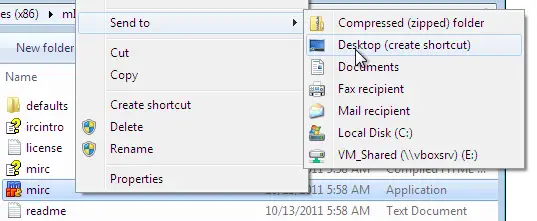
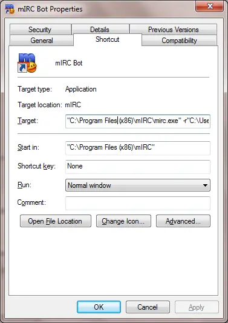

Virtual Profiles
================

mIRC does not have a built-in way to handle multiple users with different scripts and settings. This article will guide users toward easily creating multiple **Virtual Profiles** using a single installation of mIRC. Each of these virtual profiles will have the ability to run their own set of scripts and have their own set of options.

.. note:: Click :doc:`here </other/mirc_installation>` for information about how to install mIRC properly.

Create a shortcut for each profile
----------------------------------

The first thing you must do is create a shortcut for each individual profile. It is recommended that you name each shortcut something appropriate so you will know which shortcut is for which profile. To create a shortcut, navigate to the mIRC executable folder using the command below. Right click on the mIRC.exe, go to Send to and click Desktop The standard folder of mIRC.exe is *"C:\Program Files (x86)\mIRC"* or *"C:\Program Files\mIRC"*.

.. code:: text

    //run $nofile($mircexe)

Create a script folder for each profile
---------------------------------------

Creating a new folder is necessary for each of the separate profiles. The location of that folder is not very important. For example, a good place would be in the *My Documents* folder. The folder will be used to keep the individual mIRC settings as well as all the related scripts.

Instruct mIRC to use the new folders
------------------------------------

Right click on the new shortcut link and go to *Properties* In the *Shortcut* tab, replace the text next to *Target* with the following:

.. code:: text

    "<your\mIRC\exe\path>" -r"<new\folder\path>"

This change in paths must reflect the real paths of the end-user. An example of these paths would resemble the following example:

.. code:: text

    "C:\Program Files (x86)\mIRC\mirc.exe" -r"C:\Users\David\AppData\Roaming\mIRC\bot"

Clicking *OK* is the final step, and the new Virtual Profile is ready to go. The next time that mIRC is launched using this link, it will open the settings for the new profile.

